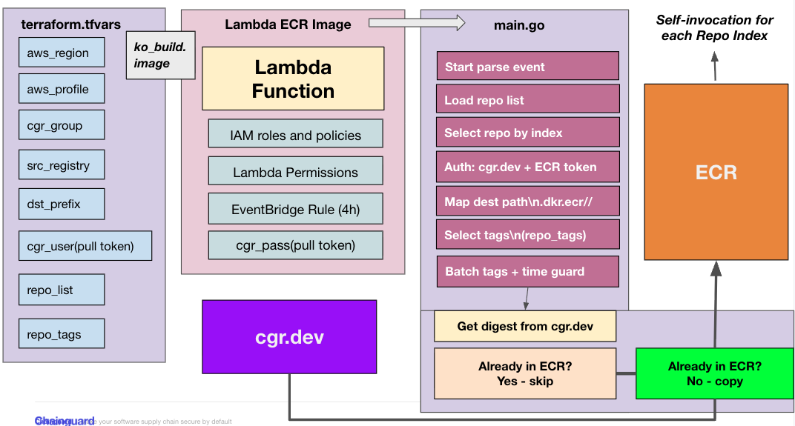

# ECR Lambda Mirror with Terraform

This project provisions a Lambda function with Terraform that mirrors images from **cgr.dev** into **AWS ECR**.

---

## Overview  

* Scans your Chainguard namespace (`cgr.dev/<group>/<repo>`).  
* Creates matching ECR repos if missing (optional `dst_prefix`).  
* Authenticates with Chainguard pull token (`CGR_USERNAME`, `CGR_PASSWORD`).  
* Authenticates to AWS ECR using the Lambda’s IAM role.  
* Mirrors tags you specify (`repo_tags`, `copy_all_tags`, or default `latest`).  
* Skips images already present in ECR (digest check).  
* Triggered on a schedule (`schedule.tf` defaults to every 4 hours).  
* Handles one repo per Lambda execution, with chaining across repos.  

---

## Architecture  



* Lambda written in Go (`main.go`) orchestrates image pulls and pushes.  
* Terraform provisions Lambda, IAM roles, CloudWatch schedule, and ECR repos.  
* Uses [go-containerregistry](https://github.com/google/go-containerregistry) for image operations.  
* `assets/arch.png` diagram shows the high-level flow.  

---

### Environment variables the Lambda expects  

Set these in your Terraform `aws_lambda_function` `environment {}`:  


```
      SRC_REGISTRY = var.src_registry
      GROUP_NAME   = var.group_name
      DST_PREFIX   = var.dst_prefix

      # Pull-token credentials for cgr.dev (username=identity id, password=JWT)
      CGR_USERNAME = var.cgr_username
      CGR_PASSWORD = var.cgr_password

      # Optional knobs for your chaining main.go
      REPO_LIST_JSON = jsonencode(var.repo_list)
      COPY_ALL_TAGS  = tostring(var.copy_all_tags)
      REPO_TAGS_JSON = jsonencode(var.repo_tags)

      # Booleans must be strings in Lambda env
      MIRROR_DRY_RUN = tostring(var.mirror_dry_run)
```

* `SRC_REGISTRY`, `GROUP_NAME`, `DST_PREFIX` → control source/destination registry paths.  
* `CGR_USERNAME`, `CGR_PASSWORD` → Chainguard pull token creds.  
* `REPO_LIST_JSON`, `COPY_ALL_TAGS`, `REPO_TAGS_JSON` → control repo/tag selection.  
* `MIRROR_DRY_RUN` → set to `true` to test without pushing.  

---

### Mirroring & Skips  

* Uses `remote.List` → enumerate tags from Chainguard.  
* Uses `remote.Get` → fetch manifests.  
* Uses `remote.Write` / `remote.WriteIndex` → push into ECR.  
* Before pushing, checks if tag+digest already exist in ECR.  
* Skips duplicates and logs the skip.  

---

### Destination Repo Settings  

Example `terraform.tfvars`:  

```hcl
aws_region  = "us-east-2"
aws_profile = "cg-dev"

group_name  = "bannon.dev"
name_prefix = "chainguar-image-mirror"

# optional: dst_prefix = "mirrors"

# identity id (username) for your pull token
cgr_username = "b3afeb8ee1de8a24fe87ccb26faee88b5ba3cac0/7d8f1d77937ae3d2"

mirror_dry_run = false

repo_list = [
  "cgr.dev/bannon.dev/datadog-agent",
  "cgr.dev/bannon.dev/node",
  "cgr.dev/bannon.dev/python",
  "cgr.dev/bannon.dev/jdk",
  "cgr.dev/bannon.dev/jre",
  "cgr.dev/bannon.dev/envoy",
]

copy_all_tags = true

repo_tags = {
  "cgr.dev/bannon.dev/node"        = ["22]
  "cgr.dev/bannon.dev/datadog-agent" = ["7.69", "7.69-dev"]
}
```

* Configure AWS region/profile, Chainguard group name, and function prefix.
* Provide Chainguard pull token username and password (JWT).
* Optional: dst_prefix to nest repos in ECR.
* Control mirroring scope with repo_list, copy_all_tags, and repo_tags.
* Example shows mirroring all tags for some repos and specific tags for others.

# Usage

## Go Mod Sanity Check

```
go mod tidy
```
## Create the repository and deploy Lambda

Note: requires pull token password during init. Your pull token username is defined in terraform.tfvars and configured to use this variable. 

* Change into iac/.
* Export AWS credentials/profile and Chainguard pull token password.
* Run terraform init, plan, and apply with cgr_password.
* Terraform provisions Lambda, ECR repos, IAM policy, and schedule.

```
cd iac/

export AWS_PROFILE=cg-dev
export AWS_REGION=us-east-2
export CGR_PASSWORD=<pull-token-pass>

terraform init -upgrade

terraform plan  -input=false \
  -var="cgr_password=$CGR_PASSWORD"

terraform apply -input=false -auto-approve \
  -var="cgr_password=$CGR_PASSWORD"
```

## Invoke the Lambda Function

```
  aws lambda invoke \
  --function-name image-copy-all \
  --region us-east-2 \
  --log-type Tail \
  --payload '{}' \
  response.json
```

## Follow the logs for progress 

```
aws logs tail /aws/lambda/image-copy-all --region us-east-2 --follow
```
For a specific image (.e Datadog)
```
aws logs tail /aws/lambda/image-copy-all --region us-east-2 --follow | grep datadog-agent
```